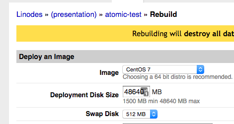
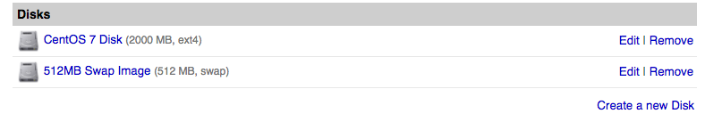
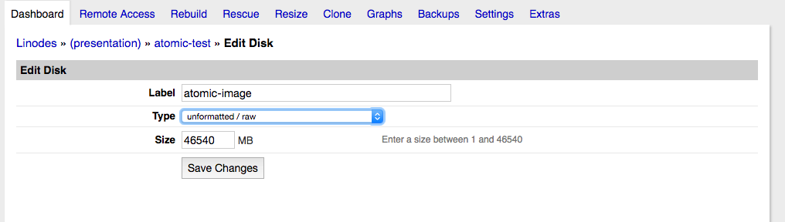
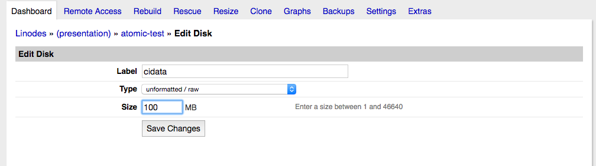
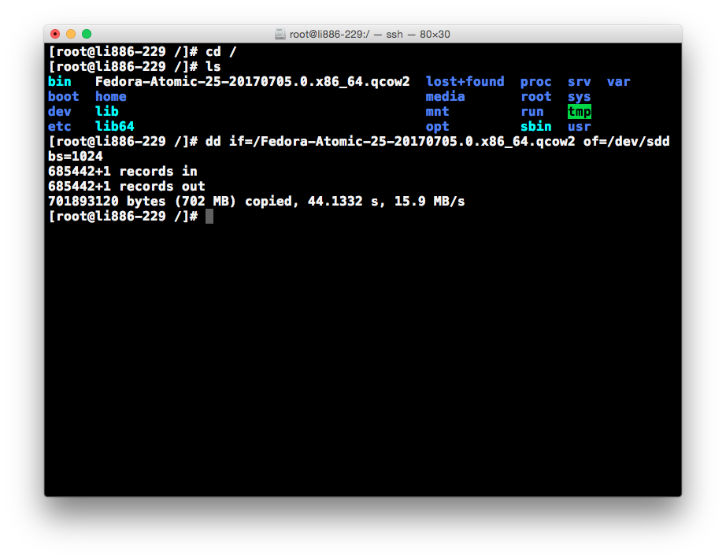

author: Derek Carter aka "goozbach" <derek@goozbach.com>
title: One Node Kubernetes Cluster
subtitle: With Project Atomic on Linode
footer: Derek Carter
subfooter: http://presentation.goozbach.com/
company: Goozbach Infrastructure Solutions LLC

# Why a One-Node Cluster?

* Kubernetes is an awesome new tech.
* I like to keep up on new tech.
* I needed to rebuild my personal server infrastructure.
* Why not containers?
* Why not "The Right Way"?

# Getting started -- Create a Linode

# Create Bootstrapping OS

"Rebuild" 
* 3500 M disk
* 512 M Swap
* CentOS 7
* Set root password

!SLIDE rebuild_bootstrapper

# Create Aux Disks

* `cidata` volume -- 100M
* `image` volume -- Rest of space

!SLIDE

!SLIDE

!SLIDE

# Modify Initial Configuration Profile

* Name: bootstrapping
* Virtual Machine Mode: `Full-virtualization`
* Disks
  * centos -- sda (leave alone)
  * swap -- sdb (leave alone)
  * cidata -- sdc (add this one)
  * atomic -- add (add this one)

# Create `Atomic` Configuration Profile

* Name: Atomic
* Virtual Machine Mode: `Full-virtualization`
* Disks
  * Atomic -- sda
  * Swap -- sdb
  * cidata -- sdc

# Boot Into `Bootstrapping` Profile

* Wait for system to boot, ssh into it.

# Setup Bootstrapping Environment

* install needed packages
  * dosfstools -- needed for mkfs.vfat
  * wget

* Download Fedora Atomic qcow2 image
  * https://getfedora.org/atomic/download/

* Create filesystem on `cidata` volume

# OPTIONAL: ipv6 issues

put this in `/etc/sysctl.d/99-noipv6.conf`

    net.ipv6.conf.all.disable_ipv6 = 1
    net.ipv6.conf.default.disable_ipv6 = 1

# Create cloud-init data files

* `meta-data` -- Machine identification
* `user-data` -- Cloud-init configuration

# `meta-data`

Contents:

    instance-id: atomic-F329-458F-AB4E-147410BC283F
    local-hostname: atomic.example.com

The field `instance-id` is a unique identifer for the machine.
Cloud init only runs once based on `instance-id`.

# `user-data`
* copy ssh host keys into `user-data`
  * allows for both "configuration profiles" to have the same ssh host key
* copy user ssh key
  * allows for passwordless logins
* create other users
  * if needed

!SLIDE

    #cloud-config
    user: goozbach
    ssh_pwauth: False
    ssh_authorized_keys:
      - '<USERKEY1>'
      - '<USERKEY2>'
    ssh_keys:
      rsa_private: |
        <INSERT CONTENTS HERE>
    
      rsa_public: <PUBKEY GOES HERE>
    
      ecdsa_private: |
        <INSERT CONTENTS HERE>
    
      ecdsa_public: <PUBKEY GOES HERE>
    
    
      ed25519_private: |
        <INSERT CONTENTS HERE>
    
      ed25519_public: <PUBKEY GOES HERE>

# Copy cloud-init files into `cidata` partition

* Mount the cidata partition

* Copy `meta-data` and `user-data` files into partiion

* Unmount partition

# Write images into `atomic` disk

!SLIDE
### Reboot into `Atomic` Configuration profile.

!SLIDE
### kubectl

!SLIDE
### Launch pods

!SLIDE
### Expose pods
